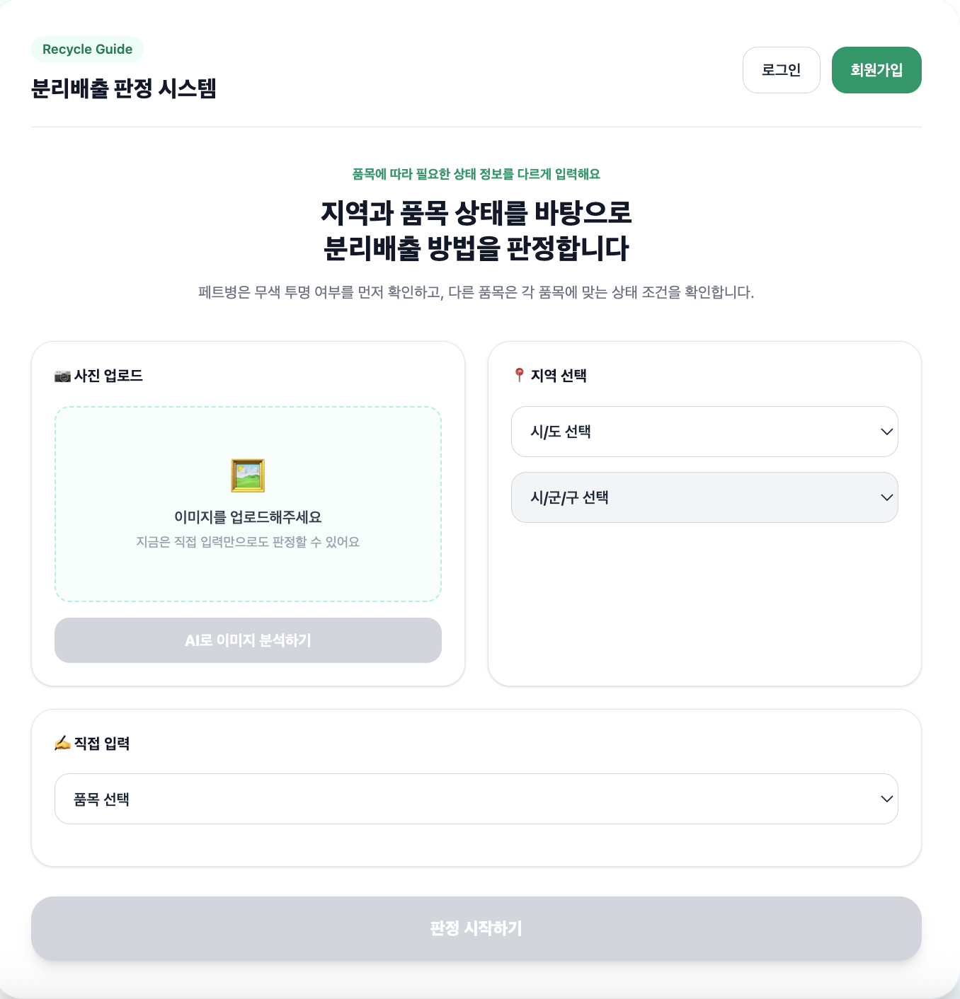

# ♻️ AI Recycling Frontend

> AI 기반 재활용품 분리배출 서비스의 프론트엔드입니다.
>
> 사용자가 재활용품 이미지를 업로드하면 AI 분석 결과를 바탕으로 품목을 판별하고, 올바른 분리배출 방법을 안내하는 웹 서비스입니다.

🌐 Demo
https://ai-recycling-frontend.vercel.app

---

# 📖 프로젝트 소개

AI 기반 재활용품 분리배출 서비스를 위한 프론트엔드 프로젝트입니다.

사용자는 재활용품 이미지를 업로드하고 지역과 배출 조건을 선택하면 AI가 품목을 분석하여 분리배출 방법을 안내받을 수 있습니다. 단순히 AI 분석 결과를 보여주는 것이 아니라 사용자가 이해하기 쉬운 형태로 결과와 분리배출 가이드를 제공하는 것에 중점을 두었습니다.

본 프로젝트는 컴퓨터공학과 졸업 프로젝트로 진행되었으며, 저는 프론트엔드 개발을 전담하여 사용자 화면 구현과 API 연동을 담당했습니다.

---

# 🛠 Tech Stack

### Frontend

- React
- TypeScript
- Vite
- Tailwind CSS
- React Router DOM

### API

- REST API
- Fetch API

### Tools

- Git
- GitHub
- Figma
- Notion

---

# 👩‍💻 담당 역할

Frontend 100%

- 전체 UI 구현
- 로그인 / 회원가입 페이지 개발
- 메인 입력 화면 개발
- AI 분석 결과 페이지 개발
- 상세 분리배출 안내 페이지 개발
- 사용자 피드백 기능 개발
- Backend API 연동
- 사용자 입력값 검증 및 상태 관리

---

# ✨ 주요 기능

- 회원가입 및 로그인
- 재활용품 이미지 업로드
- 지역 및 배출 조건 선택
- AI 분석 결과 조회
- 품목별 분리배출 방법 안내
- 상세 분리배출 가이드 제공
- 사용자 피드백 제출

---

# 📂 프로젝트 구조

```text
src
├── assets
├── pages
│   ├── MainInputPage
│   ├── ResultPage
│   ├── DetailPage
│   ├── LoginPage
│   ├── SignupPage
│   ├── FeedbackPage
│   └── FeedbackCompletePage
├── types
├── utils
├── App.tsx
└── main.tsx
```

---

# 🚀 서비스 링크

### GitHub

https://github.com/sumin0423/AI-Recycling-Frontend

### Demo

https://ai-recycling-frontend.vercel.app

---

# 🖼 화면 구성

### 메인 화면



---

# 🔧 Trouble Shooting

## 1. AI 결과와 사용자 입력 데이터 구조 통일

### 문제

AI 서버와 Backend의 응답 구조가 변경되면서 프론트엔드에서 데이터를 정상적으로 처리하지 못하는 문제가 발생했습니다.

### 해결

응답 타입을 다시 정의하고 공통 인터페이스를 작성하여 API 응답을 일관된 형태로 관리하도록 수정했습니다.

---

## 2. 지역별 분리배출 조건 처리

### 문제

지역마다 분리배출 기준이 달라 동일한 품목이라도 결과가 달라져야 했습니다.

### 해결

사용자가 선택한 지역과 조건을 함께 전달하도록 API 요청 구조를 수정하고 결과 페이지에서도 해당 정보를 함께 출력하도록 구현했습니다.

---

## 3. 사용자 입력 검증

### 문제

필수 정보를 입력하지 않아도 다음 단계로 이동하는 문제가 있었습니다.

### 해결

입력값 검증 로직을 추가하여 이미지, 지역, 조건이 모두 선택된 경우에만 AI 분석이 진행되도록 개선했습니다.

---

# 💭 회고

이번 프로젝트를 통해 단순히 화면을 구현하는 것을 넘어 AI 서버와 Backend를 연결하며 실제 서비스 개발 과정을 경험할 수 있었습니다.

특히 API 명세가 변경될 때마다 프론트엔드 구조를 수정하고, 사용자 입장에서 더 이해하기 쉬운 화면과 흐름을 고민하며 개발한 경험이 가장 의미 있었습니다.

또한 Git을 활용한 협업과 컴포넌트 분리, 타입 정의, API 연동 등의 과정을 경험하며 프론트엔드 개발 역량을 한 단계 성장시킬 수 있었습니다.

---

# 📌 프로젝트 정보

| 구분 | 내용 |
|------|------|
| 프로젝트 | AI 기반 재활용품 분리배출 서비스 |
| 기간 | 2026.03 ~ 진행 중 |
| 형태 | 컴퓨터공학과 졸업 프로젝트 |
| 담당 | Frontend 개발 |